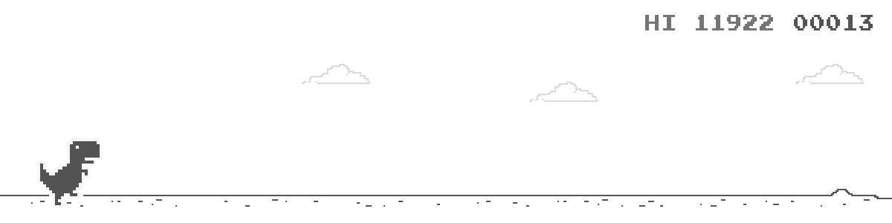

# Chome T-Rex Runner (Tensorflow-keras)
Screenshot:

# Requirements
* Python package: `requirements.txt`  
* [Firefox](www.mozilla.org)
* [Geckodriver](https://github.com/mozilla/geckodriver/releases)

# Initial files
Run `init.py` to initial files for training.  

# Training
Change TRAINING to true in `main.py` to start training.

# Run existing model
Change TRAINING to false in `main.py`to run existing model without training.  

# Tensorflow-gpu
Change TENSORFLOW_GPU in `main.py` to true to enable tensorflow-gpu.  

# To-Do list
* Enable the program able to play the original dino game(variable game-speed).
